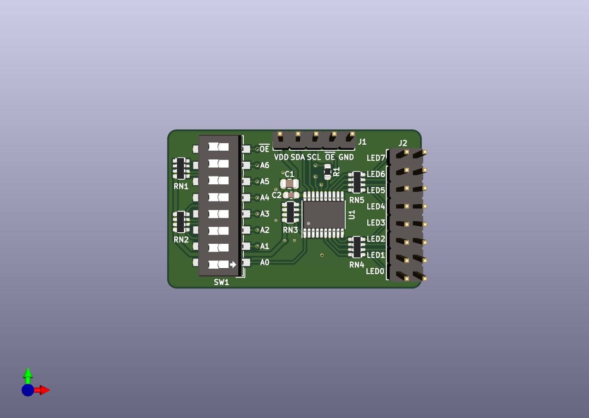

# PCA9634 Breakout Board

Small board for the 8 channel I2C-bus PWM LED driver from NXP - PCA9634 [Datasheet](https://www.nxp.com/docs/en/data-sheet/PCA9634.pdf)

Designed in KiCad 5.1.6

Schematic: [PDF](docs/pca9634-breakout.pdf)

License: [CC BY-SA 4.0](https://creativecommons.org/licenses/by-sa/4.0/)
